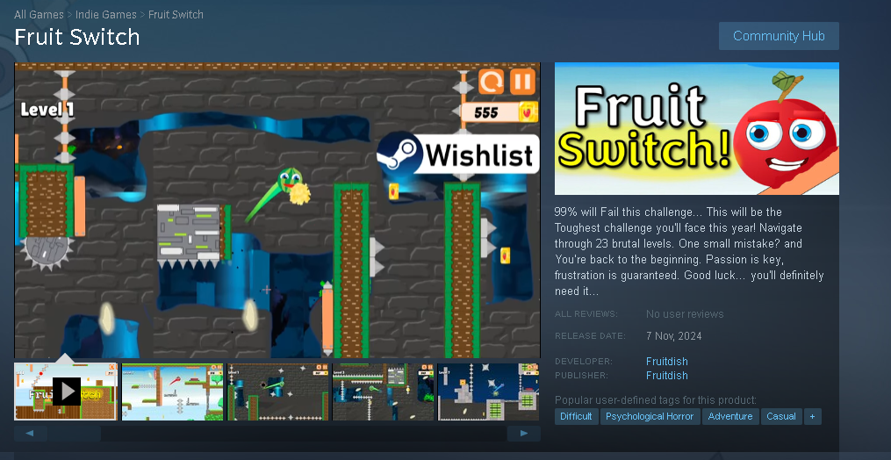

<h1 align="center">
    
</h1>
   

---

## Table of Contents

- [💫 About Me](#-about-me)
- [💻 Frameworks and Tech Stack](#-frameworks-and-tech-stack)
- [💻 Proficient Developer](#-proficient-developer)
- [🚀 DevOps tools and programs](#-devops-tools-and-programs)
- [💪 Strengths](#-strengths)
- [📊 My Coding Languages](#-github-stats)
- [🍉 Fruit Switch: A Colorful Challenge](#-fruit-switch-a-colorful-challenge)
- [🌐 Fruit Switch Social Media](#-fruit-switch-social-media)
- [📚 Code-By-Script Tutorials Social Media](#-code-by-script-tutorials)

## 🗺️ Project Organization 

I've organized my work into categories, each containing projects related to different topics. Explore them below! ⬇️

### Project Categories

- **[💻 C# Tasks](https://github.com/stars/PlutoGamerpro/lists/c-opgaver)** 
- **[🗄️ SQL Tasks](https://github.com/stars/PlutoGamerpro/lists/sql-opgaver)** 
- **[🌐 HTML/CSS Tasks](https://github.com/PlutoGamerpro/HTML-CSS-Tasks)** 
- **[🔗 API Tasks](https://github.com/stars/PlutoGamerpro/lists/api-opgaver)** 
- **[📚 My Wikis](https://github.com/stars/PlutoGamerpro/lists/mine-wikier)** 
- **[📝 UML Tasks](https://github.com/stars/PlutoGamerpro/lists/uml-opgaver)**

**You can explore all my projects 📝 and discover more of my work by visiting my 📝 [Projects](https://github.com/PlutoGamerpro?tab=stars), where I have organized my repositories into various categories!**

## 📢 Note

The code for **Fruit Switch** is proprietary, but you can experience the game on 🎮 [Steam](https://store.steampowered.com/app/2248480/Fruit_Switch/) and follow the journey on  [YouTube](https://www.youtube.com/@FruitSwitchTeam)!

# 💫 About Me:

- 👋 **Creator of [Fruit Switch](https://store.steampowered.com/app/2248480/Fruit_Switch/)** 🍉🍊
- 🎮 **Passionate about coding & game development**
- 💻 Passionate about coding & game development
- 📚 Providing tutorials for fellow learners [Code-By-Script](https://www.youtube.com/@CodeByScript)   
- 🏃‍♂️ Runner with Team R, Sparta’s sub-elite
- 🌱 Always eager to learn new technologies

🔗 Check out my Steam page here: [Fruit Switch Steam](https://store.steampowered.com/app/2248480/Fruit_Switch/) 
🔭 Currently working on Fruit Switch! Follow my journey on YouTube: [Fruit Switch Youtube](https://www.youtube.com/@FruitSwitchTeam) 
🎉 Fun Fact: My game is almost ready for release!

# 💻 Frameworks And Tech Stack

<table>
<tr>
    <td><b class="tech-name"> 1️⃣ 🎮Unity</b></td>
    <td><b class="tech-name"> 2️⃣ 🧑‍💻C#</b></td>
     <td><b class="tech-name"> 3️⃣ 🌐.NET</b></td>
    <td><b class="tech-name"> 4️⃣ 🐬MS SQL</b></td>
        <td><b class="tech-name"> 5️⃣ 🐍Pythoon</b></td>
        
   </tr>
    <td></td>
       <td></td>
           <td></td>
             <td></td>
       <td></td>
   

    
  </tr>
</table>

# 💻 Proficient Developer 
<table>
<tr>
      <td><b class="tech-name"> 1️⃣ 💻JavaScript</b></td>
        <td><b class="tech-name"> 2️⃣ 📝HTML</b></td>
        <td><b class="tech-name"> 3️⃣ 🎨CSS</b></td>
    <td><b class="tech-name"> 4️⃣ 📮Postman</b></td>
   
   
  </tr>
     <td>
       <td></td>
    <td></td>
    <td></td>
    </td>
  </tr>
</table>

# 🚀 DevOps tools and programs:
<table>
  <tr>
    <td><b class="tech-name"> 1️⃣ 🐳 Docker</b></td>
  </tr>
    <tr>
        <td></td>
     </tr>
  </table>

### 💪 Strengths
<table style="width: 100%; border-collapse: collapse;">
  <tr>
    <td style="padding: 10px; text-align: center;">
      
<strong> 1️⃣ 💪 Never Give Up</strong>

      
No matter the challenges I face, I push through and find solutions.

    </td>
    <td style="padding: 10px; text-align: center;">
      
<strong> 2️⃣ 🏆 Always Striving for Excellence</strong>

      
I take pride in delivering quality work and giving my best in everything I do.

    </td>
    <td style="padding: 10px; text-align: center;">
      
<strong> 3️⃣ 📚 Learning from Failure</strong>

      
I thrive on challenges! When things don't go as planned, I see it as an opportunity to learn something new.

    </td>
  </tr>
</table>

### 📊 My Coding Languages
 

# 🍉 Fruit Switch: A Colorful Challenge

*Fruit Switch* is developed using **Unity** and **C#**, featuring:

- **99.99% will Fail this challenge...**
- **This will be the Toughest challenge you'll face this year!**
- **Navigate through 23 brutal levels.**
- **One small mistake? and you’re back to the beginning.**
- **Passion is key, frustration is guaranteed.**
- **Good luck… you'll definitely need it...**

https://github.com/user-attachments/assets/74fd2df4-847b-4fda-af3c-b86232c6c313

| 1️⃣ How To Code Your First Program |  | 2️⃣ 99.99% Cant Beat This Game... |
|---------|---------|---------|
|  |  |  |

# 🌍 Languages
| Language      | Proficiency                                        |
|---------------|----------------------------------------------------|
| 1️⃣  DK **Danish**    | Native speaker                                     |
| 2️⃣  US **English**   | Conversational Proficiency                        |
| 3️⃣  BR **Portuguese**| Basic conversational skills, not fluent     

##  🌐 Fruit Switch Social Media:       
| **1️⃣Steam** | **2️⃣Twitter** | **3️⃣YouTube** |
|-----------|-------------|--------------|
|  |  |  | 

## 📚 Code-By-Script Tutorials:
| **1️⃣Youtube** | 
|-----------|
  | 

## ✍️ Random Dev Quote

---

